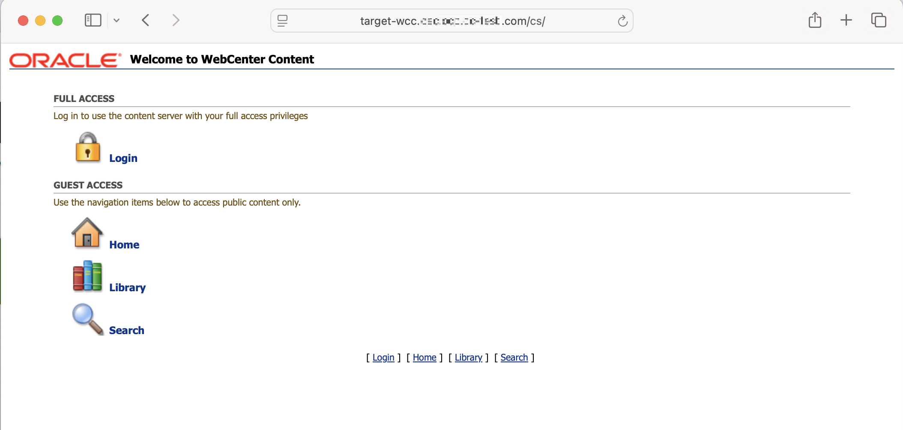
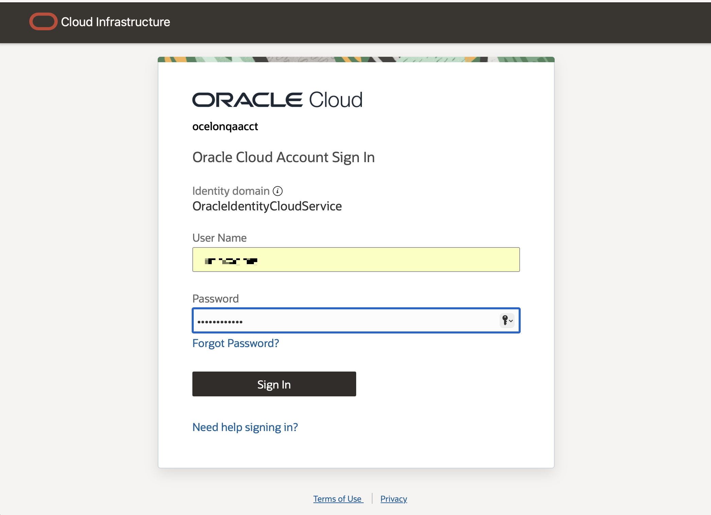
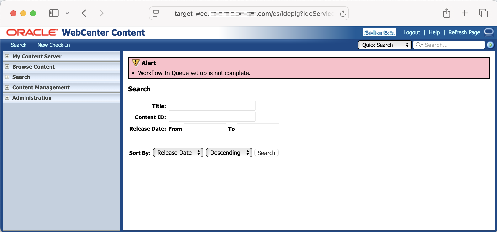
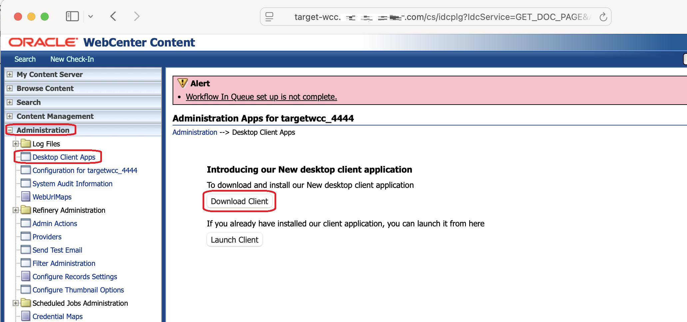
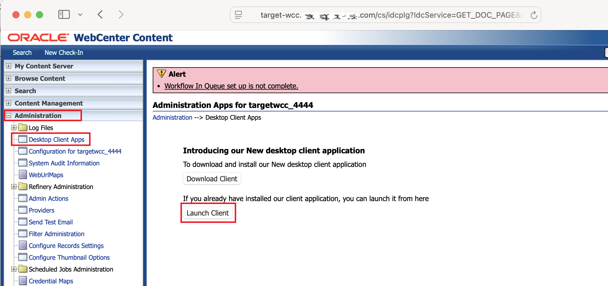
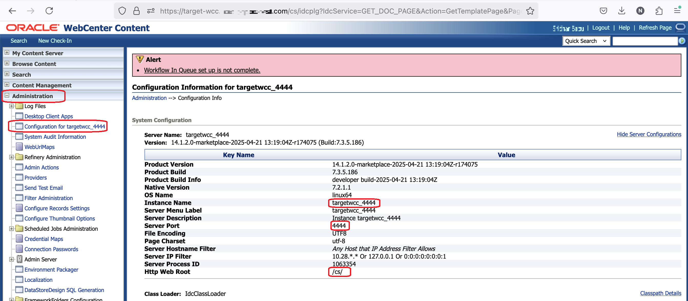

# Prepare Setup

## Introduction

This lab will show you how to setup the Archiver, a Java applet, on the Target WebCenter Content Instance.

**Estimated Lab Time**: *TBD*

### Objectives

- Setup the Archiver on Target WebCenter Content Instance
- Prepare Target Content Instance required parameters for the Archiver Configuration on the Source Content Instance.

## Task 1: Setup Archiver on Target WebCenter Content Instance
### **1.1 Sign in to WebCenter Content Administration UI**

  1. Go to the Target WebCenter Content. For example `https://target-wcc.mydomain.com/cs` 
  

  2. Enter your WebCenter Content Administrator Cloud account login credentials
  

  3. Click on "Sign In" button 
  

### **1.2 Install Oracle WebCenter Content Administration Utility application**

1. Navigate to *Administration* --> *Desktop Client Apps*  and click *Download Client* button to download *wccadmin-installer.dmg* installer for MacOS or *wccadmin-installer.exe* installer for MS Windows
  

2. Once *wccadmin-installer.dmg* downloaded, double-click on the installer to install the *Oracle WebCenter Content Administration* Utility application 
  

3. Follow onscreen instructions to complete the installation

### **1.3 Configure Archiver on the Target WebCenter Content Instance**

1. Launch WebCenter Administration utility by navigating to *Administration* --> *Desktop Client Apps*  and clicking on *Launch Client* button 
  
 or launching *Oracle WebCenter Content Administration Utility* application from your desktop
  

2. Specify WebCenter Content Administrator Cloud account login credentials and Target WebCenter Content Server URL (for example `https://target-wcc.mydomain.com/cs` )

Click "OK" button
3. In *WebCenter Administration* app, click on *Archiver*

Wait for Archiver to load

4. Click on *Edit* and then *Add* from the Archiver top menu

5. Populate Archive Name and Description and click *OK* button

6. Select newly created "TargetArchiver" and click on *Transfer To* tab. Click on *Edit* button of *Transfer Options* section

Check *Is Targetable* checkbox and click *OK* button

7. Exit from *Archiver* and *WebCenter Administraiton* App

### **1.3 Archiver Connection Informaiton for Source Archiver configuration**

1. In Target WebCenter Content Instance, navigate to *Administration* --> *Configuration Information for [System Name]* and then click on *System Configuration*

Note the values for the following parameters:
- **Instance Name**
- **Server Port**
- **Http Web Root**
- **HTTP Server Address**

 

You may now **proceed to the next lab**.

## Acknowledgements

* **Authors-** Nazar Doroshenko, Development Manager, Oracle WebCenter Content
* **Contributors-** Sameer Chikkerur, Mandar Tengse
* **Last Updated By/Date-** Nazar Doroshenko, May 2025