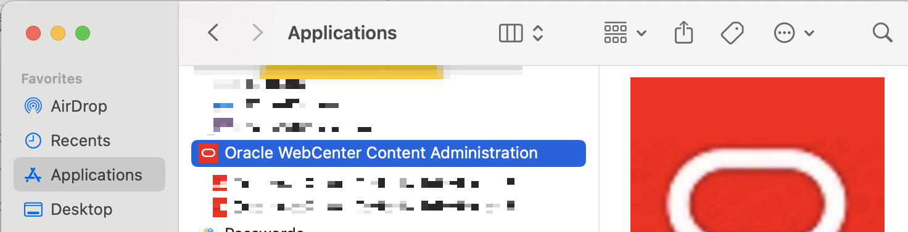

# Prepare Setup

## Introduction

This lab will show you how to configure Outgoing Provider setup the Archiver, a Java applet, on the Source WebCenter Content Instance.

**Estimated Lab Time**: *TBD*

### Objectives

- Setup the Archiver on Source WebCenter Content Instance

## Task 2: Setup Archiver on Target WebCenter Content Instance
### **2.1 Sign in to WebCenter Content Administration UI**

Complete the following steps to sign in to the Oracle Cloud Infrastructure console.

  1. Go to the Target WebCenter Content Administration UI. For example `https://source-wcc.mydomain.com/cs` 
  

  2. Enter your WebCenter Content Administrator Cloud account login credentials
  

  3. Click on "Sign In" button 
  

### **2.2 Configure Replication Provider on the Source WebCenter Content Instance**

1. In WebCenter Content UI, navigate to *Administration* --> *Providers* and click on *Add* button of *outgoing* Provider Type

2. On *Edit Outgoing Socket Provider* page populate required fields 
- **Provider Name** : Name of your choosing 
- **Provider Description** : Provider Description
- **Server Host Name** : FQDN Host name of the Target WebCenter Content System
- **Server Port** : Target WebCenter Content System port, usually 4444
- **Instance Name** : Instance name obtained from previous lab
- **Relative Web Root** : /cs/ 

Click *Add* button

3. Verify newly created provider listed in *Providers* table

NOTE that *Connection State* for the Provider we added, is *new Requires Restart*

4. Restart WebCenter Content UCM managed servers 

5. Refresh WebCenter Content UI *Administration* --> *Providers* page and verify new Outgoing provider *Connection State* is *good*
  

6. Test Outgoing Provider by clicking on *Test* link
  
  Make sure *Connection State* remains *good* and *Last Activity Date* field updated to the current date and time. 

### **2.3 Configure Archiver on the Source WebCenter Content Instance**

1. Launch *Oracle WebCenter Content Administration Utility* application installed in [1.2 Setup Archiver on Target WebCenter Content Instance](../01-target-Archiver-setup/01-target-Archiver-setup.md#1.2InstallOracleWebCenterContentAdministrationUtilityapplication) by navigating to *Administration* --> *Desktop Client Apps*  and clicking on *Launch Client* button 
  
   or by launching *Oracle WebCenter Content Administration Utility* application from your desktop
  
2. Specify WebCenter Content Administrator Cloud account login credentials and Source WebCenter Content Server URL (for example [https://source-wcc.[domain name].com/cs](https://target-wcc.[domain name].com/cs))

Click "OK" button
3. In *WebCenter Administration* app, click on *Archiver*

Wait for Archiver to load

4. Click on *Edit* and then *Add* from the Archiver top menu

5. Populate Archive Name and Description and click *OK* button

### **2.4 Add Target Collection to Source Archiver**

1. Select newly created "SourceArchiver" and click on *Options* --> *Open Archive Collections* option.

2. Click on *Browse Proxied * button.

3. In *Proxied Servers* dialog, select Source Instance name and then select Associated Source Collection Name. 

Click on *OK* button.

4. Make sure selected Source collection is now displayed in the list of Collections

Close *Collections* dialog. 

### **2.5 Configure *Transfer Destination* in Source Archiver to Target Archiver**

1. Click on *Transfer To* and *Edit* button of *Transfer Destinageion* section

2. Select Target Collection and Target Archive

Click *OK" botton
3. Make sure *Transfer To* has *Transfer Owner* and *Target Archive* populated

You may now **proceed to the next lab**.

## Acknowledgements

* **Authors-** Nazar Doroshenko, Development Manager, Oracle WebCenter Content
* **Contributors-** Sameer Chikkerur, Mandar Tengse
* **Last Updated By/Date-** Nazar Doroshenko, May 2025