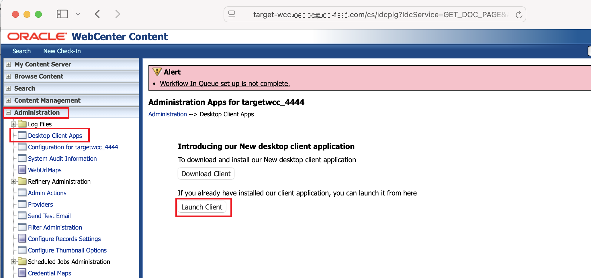

## Introduction

This lab will show you how import content archive transferred to Target Instance from Source WebCenter.

**Estimated Lab Time**: *TBD*

### Objectives

- Import content archive to Target WebCenter Instance. 

## Task 4: Import transferred Source Content Archive in Target WebCenter Content instance

### **1.4 Check Content in Source and Target Instances**

1. Before the import of Source instance archive is performed, log in to Target WebCenter and check its content

2. Log in to the Source WebCenter and check its content

### **2.4 Log in to Archiver App**

1. Launch WebCenter Administration utility by navigating to *Administration* --> *Desktop Client Apps*  and clicking on *Launch Client* button 
  
 or launching *Oracle WebCenter Content Administration Utility* application from your desktop
  

2. Specify WebCenter Content Administrator Cloud account login credentials and Target WebCenter Content Server URL (for example **https://target-wcc.[domain name].com/cs** )

Click "OK" button
3. In *WebCenter Administration* app, click on *Archiver*

Wait for Archiver to load

### **3.4 Import archive from Source instance**

1. Select the target archive and clicking on the 'View Batch Files" button: 

2. In *View Batch Files* dialog, select batch file. Make sure the *Instance Name* of the batch file matches the Target Instance name

3. Click on *Import* button.

4. Note the status of the import at the bottom of the Archiver syas *Finished* 

### **4.4 Verify Content in Target WebCenter Instance**

1. Log in to the Source WebCenter and check the content imported from Target Instance was indexed and is returned by the search

Note that it might take a few minutes for search start returning the results for imported content. 

Contgratulations **you have completed this workshop**.

## Acknowledgements

* **Authors-** Nazar Doroshenko, Development Manager, Oracle WebCenter Content
* **Contributors-** Sameer Chikkerur, Mandar Tengse
* **Last Updated By/Date-** Nazar Doroshenko, May 2025